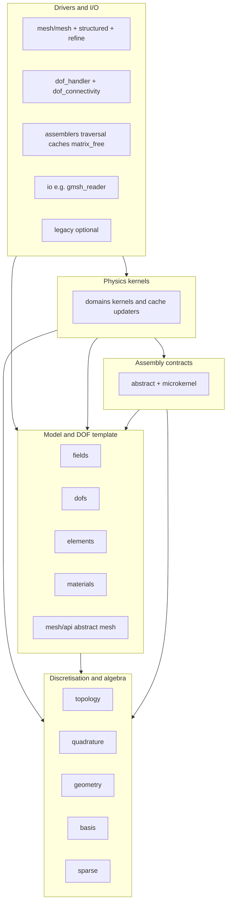

# Architecture layers

This page states the intended dependency direction between parts of
JuliaFEM.jl. It is a maintainer contract: it describes how the code is
meant to fit together. Julia does not enforce these edges the way
C++ include paths or separate link libraries do; the main concrete anchor
today is the ordered `include` list in `src/JuliaFEM.jl` (comments
`Level 1` … `Level 8`).

For motivation and a similar three-layer pattern in another project, see
[OpenPFC package architecture](https://github.com/VTT-ProperTune/OpenPFC/blob/master/docs/concepts/architecture.md)
(kernel → runtime → frontend, with an include audit on the kernel tree).

## Performance tiers (orthogonal to folder names)

Structural layers (below) say what may depend on what. Performance tiers
say how strict the implementation inside those folders should be. They
overlap: the same directory can contain setup code (tier 3) that fills
caches later consumed by tier 1 routines.

Colloquially:

- Tier 1 — kernel numeric: behaviour we want indistinguishable from
  hand-written C once LLVM optimizes. No heap allocations in inner loops,
  no reliance on exceptions on the hot path (no `try` / `catch` around
  tight loops; invariant violations should be caught at boundaries).
  Prefer plain buffers (`Vector`, `Matrix`, `StaticArrays`, structs of
  concrete bits-types), trait-driven dispatch resolved at compile time,
  and fixed-shape temporaries. `Dict`, `Set`, growable `push!` to abstract
  containers, and deliberate type instability do not belong here.
- Tier 2 — warmed drivers: orchestration that may allocate during setup
  (`create_cache`, mesh connectivity build, one-off reallocations), but
  must reach a steady state where the paths users call repeatedly (for
  example `assemble!`, `apply_K!`, time-step inner solves on fixed
  topology) stay tier 1 in practice: zero GC allocations and stable
  inference on those paths after warmup. Still avoid exceptions inside
  those inner loops.
- Tier 3 — UI / IO / preprocessing / postprocessing: file parsers,
  format conversion, exploratory scripting, legacy Dict-based APIs,
  logging-heavy diagnostics. Allocation and “Python-speed” flexibility
  are acceptable. Push parsing results into tier 2 structures before
  entering assembly.

### Where allocations are allowed vs where maximum performance is required

The table is the project policy: **setup** means “runs once or rarely when
the user builds a mesh, handler, or cache”; **steady hot path** means code
that runs per element, per quadrature point, per matvec, or inside nested
assembly loops after caches exist.

“Maximum performance” means: **zero GC allocations** on that path (after any
requested warmup), **concrete inferred types**, no `Dict` / `Set` / untyped
containers in those loops, and **no exception-based control flow** inside
them. This matches the language in `AGENTS.md` invariant 1.

| `src/` area | Setup / one-shot (allocations & flexibility) | Steady hot path (maximum performance) |
|-------------|----------------------------------------------|-------------------------------------|
| `topology/`, `quadrature/`, `geometry/`, `basis/`, `sparse/` | Keep allocation light; anything expensive belongs in tier 3 callers | Required: tier 1 |
| `materials/` | Global workspaces and cache constructors may allocate | Required tier 1 for laws invoked inside quadrature loops (`compute_stress`, tangent updates, …) |
| `elements/`, `fields/` (value types), `dofs/dofs.jl`, `physics/` (tags) | Compile-time / type-level work | Required tier 1 for `local_dof_layout`, extraction, field sizing hooks used from assembly |
| `domains/` (kernels, cache updaters, plate `dkt_basis` under domains) | — | Required tier 1 for integration bodies |
| `mesh/api.jl` | Only abstract/type tags | Not a runtime hot path |
| `mesh/mesh.jl`, `mesh/structured.jl`, `mesh/refine.jl` | Allocations normal while constructing or refining | Not tier 1 unless you later add per-IP mesh queries; assembly consumes a fixed mesh |
| `dofs/dof_handler.jl`, `dofs/dof_connectivity.jl` | Building tables and connectivity allocates | Must not become part of per-IP work |
| `assemblers/` (caches, `element_based/`, `dof_based/`, `matrix_free/`, KA port) | `create_cache`, resize, device mirror setup may allocate | Required tier 2 steady state: `assemble!`, `apply_K!`, `apply_M!`, matvec, scatter — zero GC after warmup (see `test/assemblers/test_dof_based_zero_alloc.jl`) |
| `io/` | — | Tier 3: parsing, `println`, flexible structures are OK |
| `legacy/` | — | Tier 3 by default |

Folders split by role:

- `assemblers/abstract.jl`, `microkernel.jl`: contracts and trait hooks are
  tier 1 at every site they inline into; surrounding prose can ignore perf.
- `domains/plates/` etc.: basis snippets pulled into quadrature loops are
  tier 1; any future “plate preprocessor” should stay tier 3.

Out of scope for tier 1 unless explicitly tested: `scripts/`, most of
`test/` (harness code), and interactive notebooks.

Summary labels:

| Label | Meaning |
|-------|---------|
| Tier 1 only on hot path | Maximum performance whenever code runs inside quadrature / tight assembly / material point evaluation. |
| Tier 2 steady path | Allocations OK until caches and topology are fixed; thereafter same bar as tier 1 on `assemble!` / operator apply. |
| Tier 3 | Allocations, `Dict`, and slower patterns allowed; keep this boundary outside nested assembly loops. |

New features should decide which tier their steady-state work lives in before
choosing data structures: tier 1–2 hot paths stay free of `Dict` / `Set` and
similar; reserve them for tier 3 entry points.

## Logical layers

JuliaFEM is organised into four logical layers. Names are chosen to stay
close to common FEM vocabulary and to parallel OpenPFC-style thinking
without implying a one-to-one directory rename.

### Layer A — Discretisation and algebra

Reference cells, integration rules, shape-function machinery, small
geometry helpers, and sparse scratch types used by assembly.

Typical directories: `src/topology/`, `src/quadrature/`, `src/geometry/`,
`src/basis/`, `src/sparse/`.

These should stay free of mesh file formats, solvers, and concrete
`Mesh` implementations beyond what is already in early API stubs.

### Layer B — Model and DOF template

Field quantities, DOF sets, the `Element{K,P,S,N}` template,
compile-time `local_dof_layout`, material models and traits, and abstract
mesh interfaces (`src/mesh/api.jl`).

Typical directories: `src/fields/`, `src/dofs/` (excluding
`dof_handler.jl` until it is pulled in with concrete mesh), `src/elements/`,
`src/materials/`, plus early mesh API tags.

### Layer C — Physics kernels

Discipline-specific `AbstractKernel` implementations, weak-form and
microkernel entry points, and continuum helpers that update per-element
caches (`update_*_cache!` under `src/domains/`).

This layer implements what to integrate. It may depend on layers A
and B and on the contracts in `src/assemblers/abstract.jl` (kernel
defaults) and `src/assemblers/microkernel.jl` (DOF-based microkernel
trait). It should not depend on concrete mesh readers, optional I/O, or
the legacy module.

Typical directories: `src/domains/`, `src/physics/` (type tags and shared
strain helpers used by kernels), and the two contract files above.

### Layer D — Drivers and I/O

Concrete `Mesh` types, `DOFHandler`, assemblers (element-based and
DOF-based), matrix-free operators, mesh generators, and readers.

Typical directories: `src/mesh/mesh.jl`, `src/mesh/structured.jl`,
`src/mesh/refine.jl`, `src/dofs/dof_handler.jl`,
`src/dofs/dof_connectivity.jl`, `src/assemblers/` (except the small
contract files already attributed to layer C), `src/io/`, optional
`src/legacy/`.

KernelAbstractions-based code (for example `dof_based_coo_ka.jl`) belongs
here: it chooses how and where assembly runs, analogous to a
“runtime” port in OpenPFC’s sense, not the physics statement of the weak
form.

## Allowed dependency table

The row may import or call into the column when the cell says yes.

| From / To | A Discretisation | B Model / template | C Physics | D Drivers / I/O |
|------------|:----------------:|:------------------:|:-----------:|:---------------:|
| A          | yes              | no                 | no          | no              |
| B          | yes              | yes                | no          | no              |
| C          | yes              | yes                | yes         | no              |
| D          | yes              | yes                | yes         | yes             |

“Import” here means direct file-level coupling: new `using`/`import`,
`include`, or tight type coupling that would force layer D to compile when
working only on layer A.

`JuliaFEM.Legacy` is optional and must not be required by layers A–C.
When legacy is enabled, it may depend on symbols defined anywhere in the
main module, but new code should not add dependencies from A–C into
`src/legacy/`.

## How this relates to `src/JuliaFEM.jl`

The include manifest orders work so that, in the common case, types and
functions used by layer C already exist when domain files load, while
concrete mesh and DOF-handler code loads afterward. If you add a new file,
place it in the directory that matches its layer, then insert
`include(...)` at the lowest level that still allows the module to
load (preferably next to related files).

Note: `src/assemblers/` holds both early contracts (`abstract.jl`,
`microkernel.jl`) and some concrete drivers (for example
`element_based/element_based_coo.jl`) that load before `src/domains/`
because the module is linear. Layer C code must still depend only on
contracts and shared caches, not on the internals of a specific
assembler implementation. New domain code must not reach into
element-based or DOF-based traversal details.

When domain kernel files use `using ..JuliaFEM: ...`, they pull names from
the partially-built module. That is convenient for dispatch but weak as a
boundary: reviewers should still ask whether a new dependency belongs in
layer C or only in D.

## Enforcement (today and next steps)

Compliance relies on review, on the include order in `JuliaFEM.jl`, and on a
small static audit:

- From the repository root:  
  `julia scripts/check_layer_contract.jl`  
  This fails if inner-layer trees gain forbidden references (for example Gmsh
  I/O or KernelAbstractions under `src/domains/`, or mesh drivers under layer A
  directories). CI runs the same command on every matrix job.

Further steps (not implemented yet):

- Move optional heavy or device-specific stacks behind
  [package extensions](https://pkgdocs.julialang.org/v1/creating-packages/#Conditional-loading-code-in-packages-(Extensions))
  so a minimal install stays small and dependencies stay explicit.

## See also

- `AGENTS.md` in the repository root — invariants (zero-allocation hot
  paths, type stability, element template as source of truth).
- `src/README.md` — directory map.
- [Home](@ref home) — user-facing quick start on this documentation site.
